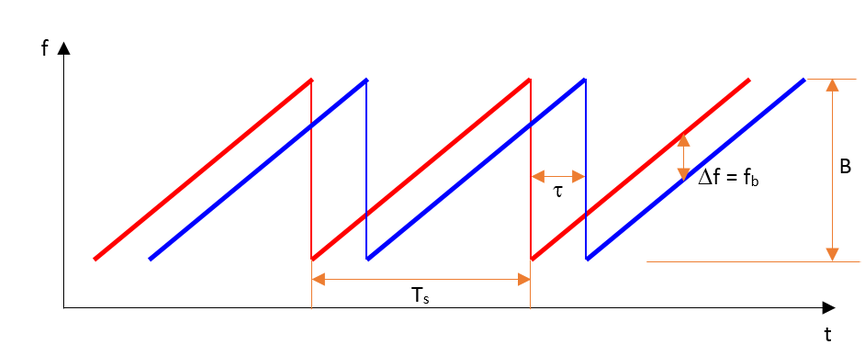
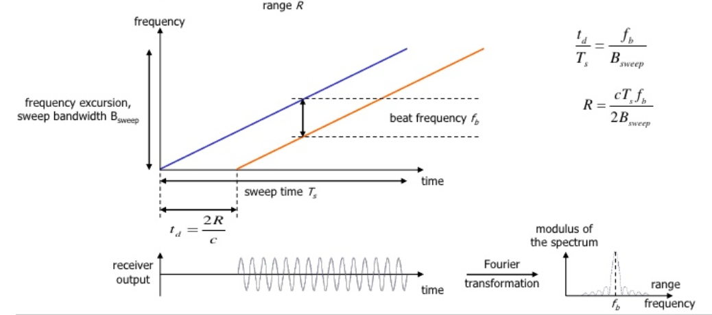
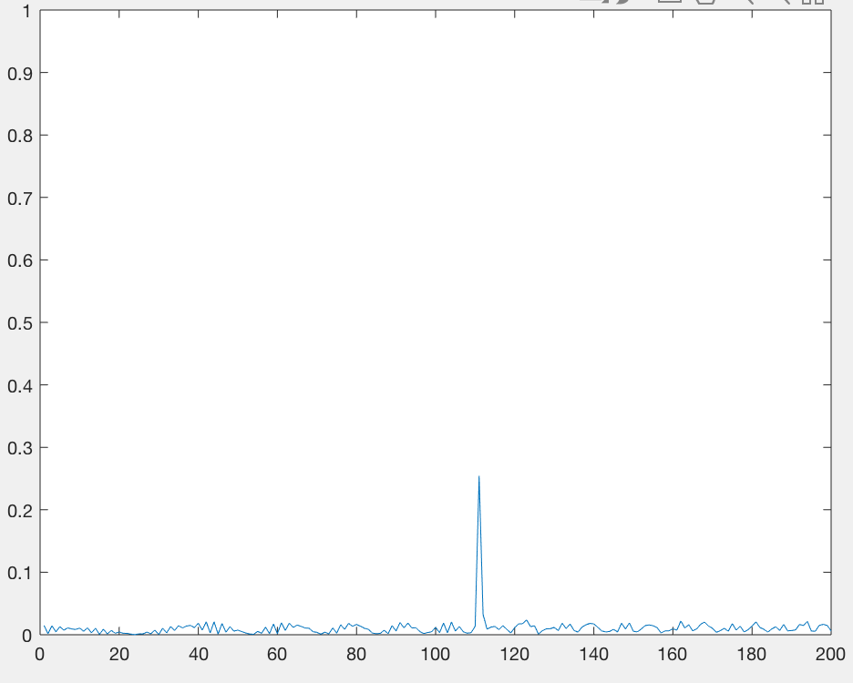
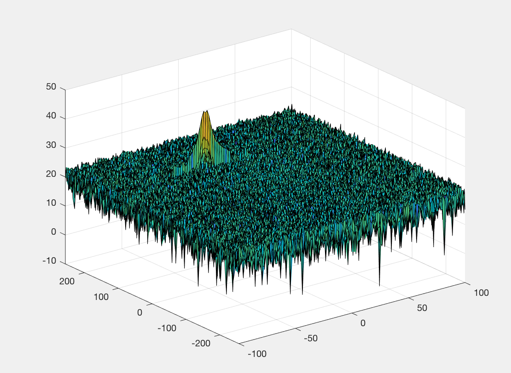
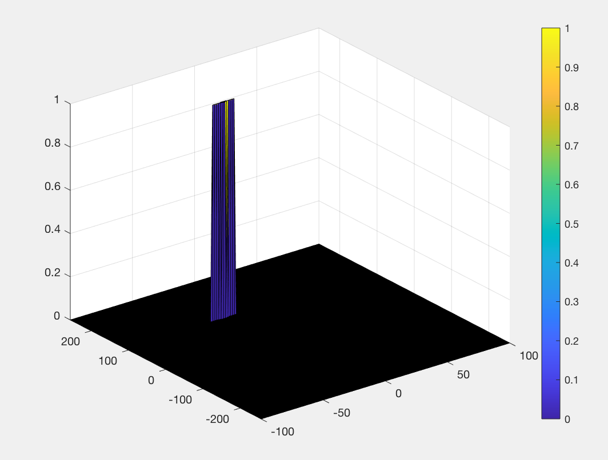

# SFND Radar Target Generation and Detection

## Project overview

  

* Configure the FMCW waveform based on the system requirements.
* Define the range and velocity of target and simulate its displacement.
* For the same simulation loop process the transmit and receive signal to determine the beat signal
* Perform Range FFT on the received signal to determine the Range
* Towards the end, perform the CFAR processing on the output of 2nd FFT to display the target.
* Project simulation implemented using MATLAB.

## FMCW Waveform Design
Using the given system requirements, design
a FMCW waveform. Find its Bandwidth (B), chirp time (Tchirp) and slope of the chirp.

  

  

~~~
target_initial_position = 110;
target_initial_velocity = -22;

%% FMCW Waveform Generation

% *%TODO* :
%Design the FMCW waveform by giving the specs of each of its parameters.
fc= 77e9;             %carrier freq
range_max = 200;      %max range of radar meters
delta_r =1;           %range resolution in meters
c = 3e8;              %speed of light
velocity_max = 70;    %max velocity m/s
% Calculate the Bandwidth (B), Chirp Time (Tchirp) and Slope (slope) of the FMCW
% chirp using the requirements above.
B = c/2*delta_r;                    %Bandwidth
Tchirp = (5.5*2*range_max)/c;       %chirp time
slope = B/Tchirp;                   %Slope = 2.0455e+13
~~~

## Simulation Loop
Simulate Target movement and calculate the beat or mixed signal for every timestamp.

  

~~~
%The number of chirps in one sequence. Its ideal to have 2^ value for the ease of running the FFT
%for Doppler Estimation. 
Nd=128;                   % #of doppler cells OR #of sent periods % number of chirps
%The number of samples on each chirp. 
Nr=1024;                  %for length of time OR # of range cells
% Timestamp for running the displacement scenario for every sample on each
% chirp
t=linspace(0,Nd*Tchirp,Nr*Nd); %total time for samples

%Creating the vectors for Tx, Rx and Mix based on the total samples input.
Tx=zeros(1,length(t)); %transmitted signal
Rx=zeros(1,length(t)); %received signal
Mix = zeros(1,length(t)); %beat signal

%Similar vectors for range_covered and time delay.
r_t=zeros(1,length(t));
td=zeros(1,length(t));

%% Signal generation and Moving Target simulation
% Running the radar scenario over the time. 

for i=1:length(t)         
    % *%TODO* :
    %For each time stamp update the Range of the Target for constant velocity. 
    range = target_initial_position + target_initial_velocity * t(i);
    trip_time = (2*range)/c;
    % *%TODO* :
    %For each time sample we need update the transmitted and
    %received signal. 
    Tx(i) = cos(2*pi*(fc*t(i) + (slope*t(i)^2)/2));
    Rx(i) = cos(2*pi*(fc*(t(i)-trip_time) + (slope*(t(i)-trip_time)^2)/2));
    
    % *%TODO* :
    %Now by mixing the Transmit and Receive generate the beat signal
    %This is done by element wise matrix multiplication of Transmit and
    %Receiver Signal
    Mix(i) = Tx(i) * Rx(i);
    
end
~~~
## Range FFT (1st FFT)
Implement the Range FFT on the Beat or Mixed Signal and plot the result.
~~~
 % *%TODO* :
%reshape the vector into Nr*Nd array. Nr and Nd here would also define the size of
%Range and Doppler FFT respectively
Mix_1D = reshape(Mix,[Nr,Nd]);

 % *%TODO* :
%run the FFT on the beat signal along the range bins dimension (Nr) and
%normalize.
Y = (fft(Mix_1D, Nr))/Nr;

 % *%TODO* :
% Take the absolute value of FFT output
P2 = abs(Y);

 % *%TODO* :
% Output of FFT is double sided signal, but we are interested in only one side of the spectrum.
% Hence we throw out half of the samples.
P1 = P2(1:Nr/2+1);
~~~
Output for 1st FFT (A target detected at 110m):

  

Output for 2st FFT (A target detected at 110m, at a velocity of -22 m/s):

  

## Implementation steps for the 2D CFAR process

* Determine the number of Training cells for each dimension. Similarly, pick the number of guard cells. Also set offset.
~~~
Tr=12;
Td=8;
Gr=4;
Gd=2;
offset=6;

~~~   
* Slide the cell under test across the complete matrix. Make sure the CUT has margin for Training and Guard cells from the edges.
* For every iteration sum the signal level within all the training cells. To sum convert the value from logarithmic to linear using db2pow function.
* Average the summed values for all of the training cells used. After averaging convert it back to logarithmic using pow2db.
* Further add the offset to it to determine the threshold.
* Next, compare the signal under CUT against this threshold.
* If the CUT level > threshold assign it a value of 1, else equate it to 0.
~~~
for i = Tr+Gr+1 : size(RDM,1) - (Tr+Gr)
    for j = Td+Gd+1 : size(RDM,2) - (Td+Gd)
        noise_level = zeros(1,1);
        for k = i-(Gr+Tr): i + (Gr+Tr)
            for l = j-(Gd+Td) : j+(Gd+Td)
                if (abs(i - k) > Gr || abs(j - l) > Gd)
                   noise_level = noise_level + db2pow(RDM(k,l));
                end
            end
        end
        threshold_cfar = pow2db(noise_level / ((2*Tr+2*Gr+1)*(2*Td+2*Gd+1)-(2*Gr+1)*(2*Gd+1))) + offset;
        CUT = RDM(i,j);
        if (CUT > threshold_cfar)
          RDM_threshold_cfar(i,j) = 1;
        else
           RDM_threshold_cfar(i,j) = 0;
        end
            
    end
end
~~~

The process above will generate a thresholded block, which is smaller than the Range Doppler Map as the CUTs cannot be located at the edges of the matrix due to the presence of Target and Guard cells. Hence, those cells will not be thresholded.

To keep the map size same as it was before CFAR, a new matrix is created and is appended which is used as the output.
~~~
RDM_threshold_cfar=zeros(size(RDM));
~~~
Output for 2D CFAR:

  

